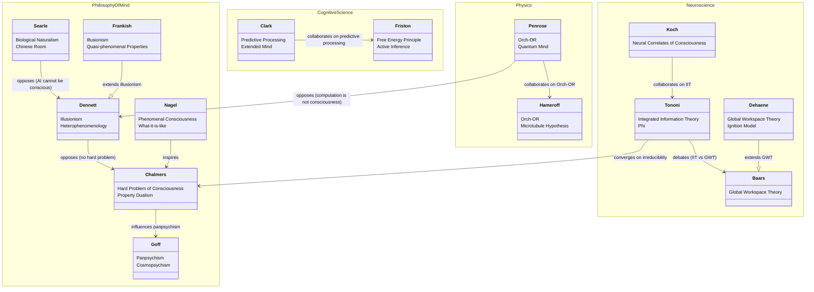

# Consciousness Studies — Relationship Map

A map of key researchers and disciplines, and how they relate to each other.

## Reading the Diagram

| Relation | Meaning |
|---|---|
| `A --> B : inspires` | A's work directly shaped B's framework |
| `A --> B : collaborates` | A and B developed a theory jointly |
| `A --|> B` | A extends or builds on B's position |
| `A --> B : converges on` | A and B arrive at compatible conclusions from different directions |
| `A --> B : opposes` | A's position directly challenges B's |
